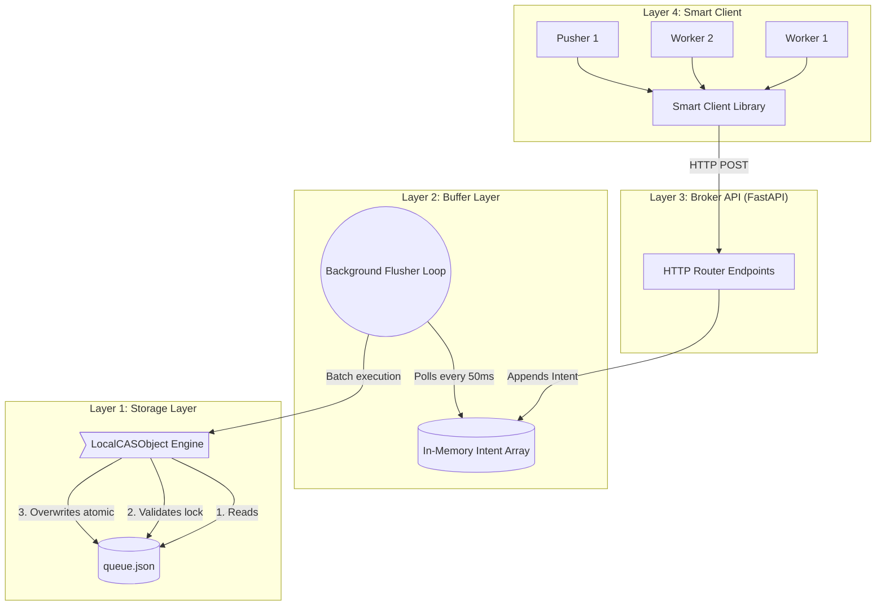

A lightweight, highly-available, distributed job queue built entirely on top of a single local JSON file using atomic Compare-And-Swap (CAS) operations. 

This project is a functional, local implementation of the architecture described in [Turbopuffer's "How to build a distributed queue in a single JSON file on object storage"](https://turbopuffer.com/blog/object-storage-queue).

When building multi-agent AI systems or high-throughput async processing pipelines, managing state is the hardest part. You usually need bulky infrastructure like Redis, Celery, or RabbitMQ.

This project proves you can achieve **robust distributed coordination** using nothing more than a dumb storage system (like AWS S3, Google Cloud Storage, or in this case, a local OS file) as long as it supports atomic CAS (Compare-And-Swap). 

- **Idempotent Pushes:** Reconnected agents safely re-queue without duplicating work.
- **Failover / HA:** If the Broker crashes, the Smart Client instantly detects it, spawns a new Broker, and seamlessly retries.
- **Lease Timeouts:** If a worker crashes mid-job, the lease expires and another worker claims it.
- **Batched Throughput:** The broker groups thousands of concurrent requests into a single atomic JSON write.

## The Life of a Job

When you call `client.push({"task": "send_email"})`, here is how it actually travels through the codebase:

1. **The Entrypoint:** Your script asks `SmartQueueClient` to push. Without opening any files, the client sends an HTTP `POST` to the FastAPI Broker.
2. **The Waiting Room (`service.py`):** The Broker catches the HTTP request, turns the job into an `Intent`, and throws it into a temporary in-memory `List` (the Buffer). The HTTP endpoint *pauses* right here and waits.
3. **The Garbage Truck:** Every 50 milliseconds, a background background thread grabs the entire contents of the Buffer (your job + hundreds of other jobs from other scripts sent simultaneously) and forms one massive "Batch".
4. **The Atomic Save (`storage.py`):** The storage layer opens `queue.json`, validates that no one else is currently editing it, applies the entire Batch of jobs to the JSON dictionary in Python's memory, and atomically renames the temporary JSON map over the old file. 
5. **The Reply:** Once the massive batch save succeeds, the Garbage Truck wakes up your paused HTTP endpoint, which returns `{"status": "ok"}` to your script!

By forcing massive traffic jams to wait in the Buffer and grouping them into a single massive write, we achieve incredible multi-process throughput on a single dumb JSON file.

## Architecture



## Run

```bash
python3 -m venv .venv
source .venv/bin/activate
pip install fastapi httpx uvicorn pydantic pydantic-settings
```

### The pure CAS Benchmark
Watch 20 independent Python threads try to hammer the JSON file directly. You'll see thousands of conflicts as they fight for the single CAS lock.
```bash
PYTHONPATH=. python3 tests/test_benchmark.py
# (Wait for Phase 1 to finish, then watch Phase 4 seamlessly batch them)
```

### The Chaos / Fault Tolerance Simulation
Watch the queue recover from catastrophes in real-time.
```bash
PYTHONPATH=. python3 tests/test_faults.py
```
This script will:
1. Hard-crash a worker to prove lease timeouts work and jobs are reclaimed.
2. Hard-terminate the active FastAPI broker while it's processing data.
3. Prove that the SmartClient automatically detects the downtime, elects a new port, boots a new FastAPI instance, and successfully finishes the pending request *without* any data loss.